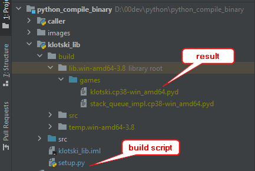
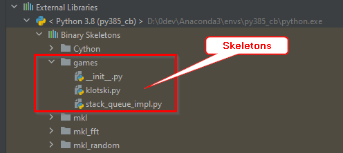

## Compile Python code to binary

There are 2 main reason why we want to do this:
<ul>
    <li>Hide python code in the binary file</li>
    <li>Performance speed up</li>
</ul>

There are 2 styles of compiling:
<ul>
    <li>Compile to an executable</li>
    <li>Compile to a shared lib</li>
    <li>Compile some code to a shared lib, then compile the rest to an 
    executable</li>
</ul>

There are several tools for this purpose, google "python compile to executable".
Here, we are going to use Cython to create a shared binary lib from python code
in the module base_lib, then will call this lib from module caller in Python. 
Finally, we compile caller to binary app as well with PyInstaller, referencing 
base_lib's binary lib. Another tool, Nuitka, is similar to Cython.

#### Compile shared libs with Cython

To run build:
```
cd klotski_lib
python setup.py build_ext
```
The output is in the build folder, if there is no error.  



(Why can't we align images with **one liners**? CSS and HTML solutions are heavy.)

There are several catches in Cython:
<ul>
    <li>
        Cannot compile several python files/modules into one shared lib. 
        Ideally, we want to compile a folder/component into one shared lib.
    </li>
    <li>
        We need to specify build_dir="build" in order to keep source folder
        clean and move all generated artifacts to build folder.
    </li>
    <li>
        The build generates .pyd on windows and .so on linux, with proper name
        specified in the Extension name field  + Cython version and OS info.
    </li>
</ul>

Compiling large number of python files is tedious. There is a good attempt
https://bucharjan.cz/blog/using-cython-to-protect-a-python-codebase.html
but it's not generic.

Now we can install the lib using softlink:
```
pip install -e .
```
In IntelliJ, we should see the skeleton files



Sometimes, this is delayed. We may force IntelliJ. Invalidate Caches and 
Restart in the file menu should fix the missing references.

#### Calling shared binary lib from Python
In the caller module, the app should run fine.

We may also compile this module into executables as well, with PyInstaller.
There are 2 options, build a standalone executable or an executable with libs.

We need to tell PyInstaller where to scan the imports:
```
--paths=src\game_tests
```
Furthermore, we need to tell PyInstaller to scan submodules not in the above
folders but used download the road:
```
--hidden-import games.stack_queue_impl
```
Otherwise, we would get no module found error. This adds more work for dev to
track down all imports in submodules.

Optionally we may add version info to the executable, check:  
https://stackoverflow.com/questions/14624245/what-does-a-version-file-look-like  


The build result is in the dist folder. The build config is saved to the file
klotski_app.spec during the build. Don't modify this file if the python file
with main() is used as the target in the build. Otherwise, maintain the .spec
file and use it as the build target.

Interesting observations:
klotski_lib binary is faster than python code.
klotski app binary is slower than python code.

We may wrap c libs to python as well with Cython, for example:
https://stavshamir.github.io/python/making-your-c-library-callable-from-python-by-wrapping-it-with-cython/
Another tool is SWIG: http://www.swig.org/tutorial.html

Other options are numba, pypy, but they take more effort for general purpose usage.
